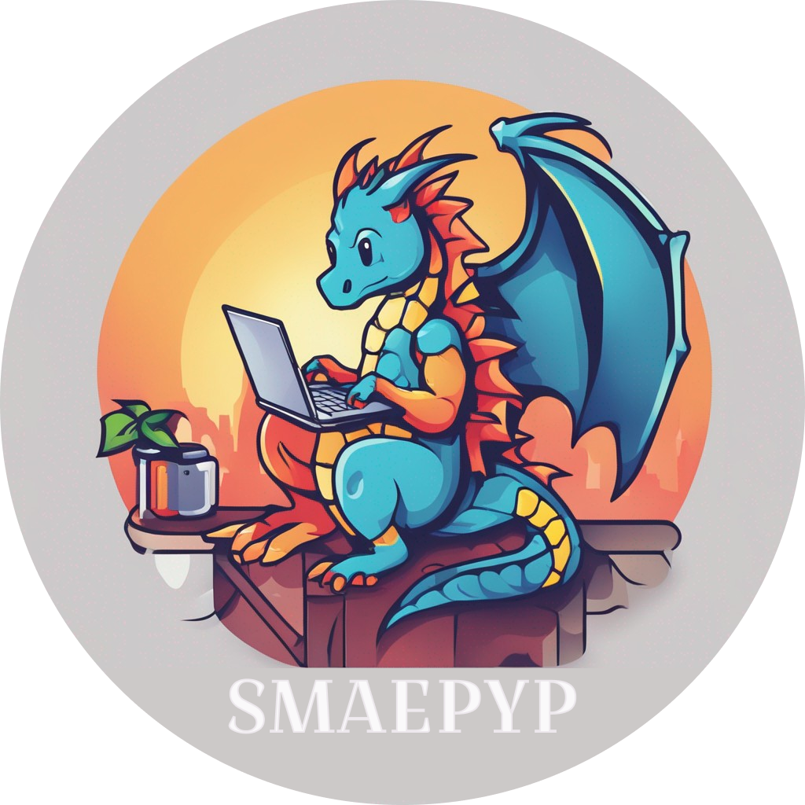

[![Contributors][contributors-shield]][contributors-url]
[![Forks][forks-shield]][forks-url]
[![Stargazers][stars-shield]][stars-url]
[![Issues][issues-shield]][issues-url]
[![MIT License][license-shield]][license-url]
[![LinkedIn][linkedin-shield]][linkedin-url]


<!-- PROJECT LOGO -->
<br />
<div align="center">
  <a href="https://github.com/Navi-SS">
    
  </a>

  <h3 align="center">Simulación Matematica</h3>

  <p align="center">
    Un repositorio con códiogs en Python
    <br />
    <br />
    <a href="https://github.com/Navi-SS/Simulacion">Material adicional</a>
    ·
    <a href="https://github.com/Navi-SS/Simulacion/issues/new?labels=bug&template=bug-report---.md">Reportar un Error</a>
    ·
    <a href="https://github.com/Navi-SS/Simulacion/issues/new?labels=enhancement&template=feature-request---.md">Solicitar una mejora</a>
  </p>
</div>


<!-- TABLE OF CONTENTS -->
<details>
  <summary>Tabla de contenido</summary>
  <ol>
    <li>
      <a href="#acerca-del-proyecto">Acerca del proyecto</a>
      <ul>
        <li><a href="#construido-con">Construido con</a></li>
      </ul>
    </li>
    <li>
      <a href="#comienza-a-usarlo">Comienza a usarlo</a>
      <ul>
        <li><a href="#prerequisitos">Prerequisitos</a></li>
        <li><a href="#instalación">Instalación</a></li>
      </ul>
    </li>
    <li><a href="#contribución">Contribución</a></li>
    <li><a href="#licencia">Licencia</a></li>
    <li><a href="#contacto">Contacto</a></li>
    <li><a href="#gratitudes">Gratitudes</a></li>
  </ol>
</details>


<!-- ABOUT THE PROJECT -->
## Acerca Del Proyecto

Este repositorio cuenta con los diversos ejemplos para la simulación matematica de yacimientos en las 3 dimensiones y múltiples casos de uso, solo accede a la carpeta para el ejemplo requerido y hacer uso.

### Construido Con

El proyecto esta creado en el lenguaje de programación Python en su versión 3.12.X

* [![Python][Python]][Python-url]

<!-- GETTING STARTED -->
## Comienza A Usarlo

Este es un ejemplo de como logar ejecutar el proyecto y sus funciones internas.
Primero genera una copia del repositorio en tu local.

### Prerequisitos

Esta es la lista de blibliotecas o paqueterias que debes instalar para ejecutar el proyecto de forma adecuada.
* pip
  ```sh
  pip install -r requirements.txt
  ```

### Instalación

_Abajo se muestra una guía para la instalación del repositorio_

1. Clonar el repositorio
   ```sh
   git clone https://github.com/your_username_/Simulacion.git
   ```
2. Instalar las paqueterias
   ```sh
   pip install -r requirements
   ```


<!-- CONTRIBUTING -->
## Contribución

La contibución hace que la comunidad del open source sea un gran lugar para aprender, inspirar y crear. Cualquier contribución que realices sera **muy agradecida**

Si tienes una sugerencia para mejorar el proyecto, por favor realiza un fork al repositorio y crea un pull request. Tambien puedes hacer algo an simple como abrir una incidencia con el tag "mejora".

No olvides darle una estrella al repositorio :D! Muchas Gracias!


1. Realiza un fork al proyecto
2. Crea tu rama (`git checkout -b feature/AmazingFeature`)
3. Realiza tus cambios con commit (`git commit -m 'Add some AmazingFeature'`)
4. Sube tu rama (`git push origin feature/AmazingFeature`)
5. Abre un Pull Request


<!-- LICENSE -->
## Licencia

Distribuido bajo la licencia MIT. Mira el archivo `LICENSE.txt` para más información.

<!-- CONTACT -->
## Contacto

Mi contacto - [VCard](https://vcard.idkey.com.mx/pmobnj7/)

Link de SMAEPYP: [https://smaepyp.super.site/](https://smaepyp.super.site/)


<!-- ACKNOWLEDGMENTS -->
## Gratitudes

Utilice este espacio para enumerar los recursos que le resulten útiles y a los que le gustaría dar crédito. ¡He incluido algunos de mis favoritos para comenzar!

* [Choose an Open Source License](https://choosealicense.com)
* [GitHub Emoji Cheat Sheet](https://www.webpagefx.com/tools/emoji-cheat-sheet)
* [Malven's Flexbox Cheatsheet](https://flexbox.malven.co/)
* [Malven's Grid Cheatsheet](https://grid.malven.co/)
* [Img Shields](https://shields.io)
* [GitHub Pages](https://pages.github.com)
* [Font Awesome](https://fontawesome.com)
* [React Icons](https://react-icons.github.io/react-icons/search)

<!-- MARKDOWN LINKS & IMAGES -->
<!-- https://www.markdownguide.org/basic-syntax/#reference-style-links -->
[contributors-shield]: https://img.shields.io/github/contributors/Navi-SS/Simulacion.svg?style=for-the-badge
[contributors-url]: https://github.com/Navi-SS/Simulacion/graphs/contributors
[forks-shield]: https://img.shields.io/github/forks/Navi-SS/Simulacion.svg?style=for-the-badge
[forks-url]: https://github.com/Navi-SS/Simulacion/network/members
[stars-shield]: https://img.shields.io/github/stars/Navi-SS/Simulacion.svg?style=for-the-badge
[stars-url]: https://github.com/Navi-SS/Simulacion/stargazers
[issues-shield]: https://img.shields.io/github/issues/Navi-SS/Simulacion.svg?style=for-the-badge
[issues-url]: https://github.com/Navi-SS/Simulacion/issues
[license-shield]: https://img.shields.io/github/license/Navi-SS/Simulacion.svg?style=for-the-badge
[license-url]: https://github.com/Navi-SS/Simulacion/blob/master/LICENSE.txt
[linkedin-shield]: https://img.shields.io/badge/-LinkedIn-black.svg?style=for-the-badge&logo=linkedin&colorB=555
[linkedin-url]: https://www.linkedin.com/in/ivan-casta%C3%B1eda/
[Python]: https://img.shields.io/badge/python-3670A0?style=for-the-badge&logo=python&logoColor=ffdd54
[Python-url]: https://www.python.org